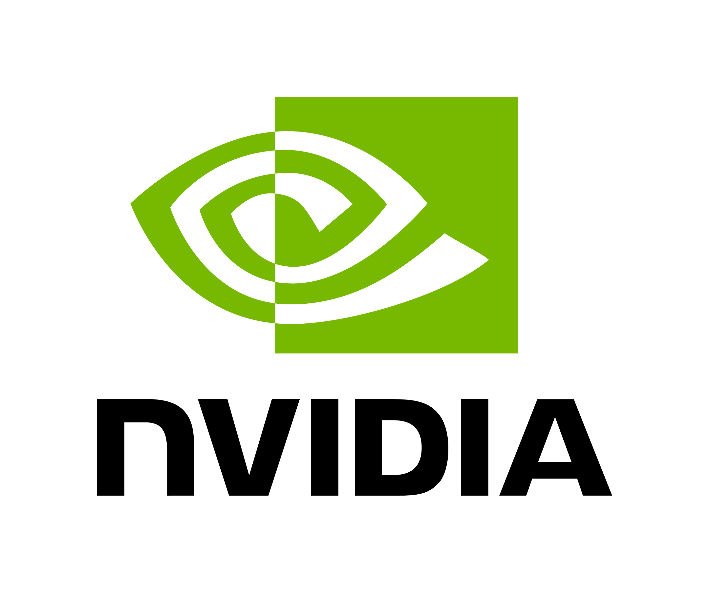

# Free LLM API Provider
> Last updated: **2026-05-09**

This is a list of free llm providers and their rate usage limits. 
免费LLM api平台（包括cn平台）

<table align="center">
  <tr>
    <td align="center"></td>
    <td align="center"></td>
    <td align="center"></td>
    <td align="center"></td>
    <td align="center"></td>
    <td align="center"></td>
  </tr>
  <tr>
    <td align="center"></td>
    <td align="center"></td>
    <td align="center"></td>
    <td align="center"></td>
    <td align="center"></td>
    <td align="center"></td>
    </td>
  </tr>
</table>

You may also want to read my other posts: 
- [**How to Choose Your LLM For Translation?**](https://github.com/CYBIRD-D/How-to-Choose-your-LLM-Model-for-translation/tree/main)
- [Model & Performance FAQ](https://github.com/CYBIRD-D/How-to-Choose-your-LLM-Model-for-translation/blob/main/FAQ_EN.md#models--performance)
- [**Local LLMs Collection For Translation**](https://github.com/CYBIRD-D/Local-LLMs-Collection-For-Translation/tree/main)

---------

**Easy guide** to deploy online LLM api（luna）:
  - sign up/register;
  - get **api key** and **endpoint address** in your account/setting etc
  - put it in luna or the softwares support it.

## Content/目录
- [Global Platform](#global-platform)
  - [Google/Gemma 3/4](#google-gemini-googlegemma-34)
  - [★Nvidia(40RPM)](#nvidia)
  - [★Ollama](#ollama)
  - [★Groq](#groq)
  - [★Cerebras](#celebras)
  - [OpenRouter](#openrouter)
  - [Cloudflare](#cloudflare)
  - [Cohere](#cohere)
  - [Z.ai (GLM-4.5/4.7-Flash)](#zai-glm-4547-flash)
  - [GitHub Models](#github)
  - [Mistral](#mistral)
  - [SKT](#skt)
  - [IBM](#ibm)
  - [Scaleway (1M free token/per account)](#scaleway-1m-free-tokenper-account-no-refresh)
- [CN Platform](#cn-platform)
  - [ModelScope（魔搭社区）](#modelscope魔搭社区仅限cnonly-cn)
  - [SilliconFlow 硅基流动](#silliconflow-硅基流动)
  - [Tencent-Hunyuan 腾讯混元](#tencent-hunyuan-腾讯混元)
  - [Volcengine 火山引擎（平台）](#volcengine-火山引擎平台-500-point-资源点day)
  - [心流](#心流)
  - [StreamLake 快手万擎Vanchin](#StreamLake-快手万擎Vanchin)
  - [Spark 讯飞星火](#spark-讯飞星火)

-----------

## Global Platform

### ~~Google Gemini~~ Google/Gemma 3/4
Community reports that **Gemma 3** is working properly.  
~~https://ai.google.dev/gemini-api/docs/rate-limits#free-tier~~ 
> Last updated: **2026-05-09 UTC**  
> **RPM**: Requests per minute  
> **TPM**: Tokens per minute 
> **RPD** Requests per day 

- No free api for Gemini 3 Pro  
https://ai.google.dev/gemini-api/docs/gemini-3?thinking=high#faq  

Endpoint: https://generativelanguage.googleapis.com

| Model                     | Requests/minute (RPM) | Tokens/minute (TPM) | Requests/day (RPD) |
|---------------------------|---------------------------|--------------------------|-----------------|
| Gemini 2.5 Flash   Gemini 3 Flash | 5             | 250k                     | 20              |
| Gemini 2.5 Flash Lite     | 10                        | 250k                     | 20              |
| Gemini 3.1 Flash Lite     | 15                        | 250k                     | 500             |
| Gemma 4 26B/31B           | 15                        | Unlimited                | 1.5K            |
| **Gemma 3 (1B/2B/4B/12B/27B)**  | 30                  | 15k                      | 14.4k           |
~~gemini 2 Flash/Lite~~
~~gemini 2.5/3.1 Pro~~

**Google has set gemini limit to low rate**.

**★Other solutions:**  
[**Google AI Studio to API Adapter**](https://github.com/iBUHub/AIStudioToAPI/blob/main/README_EN.md)

 

-------

### Nvidia
> Last updated: **2026-04-21**  

https://build.nvidia.com/explore/discover  
Endpoint: https://integrate.api.nvidia.com

**Rate limit**: Usually up to **`40`** Requests per minute(RPM) 
> Nvidia: Maximum API requests accepted in a given timeframe.  
Rate limits may vary by model and traffic from other users may cause throttling.  
> For dedicated availability, deploy models as a dedicated endpoint with NVIDIA NIM.

- **129** Models list
  - OpenAI/Google/Meta/Microsoft/NVIDIA/IBM/Databricks/Mistral AI/AI21 Labs/DeepSeek/Moonshot AI/Z-ai/Minimax etc.

## Model List

#### 01-ai

1 model

- `01-ai/yi-large`

#### abacusai

1 model

- `abacusai/dracarys-llama-3.1-70b-instruct`

#### adept

1 model

- `adept/fuyu-8b`

#### ai21labs

1 model

- `ai21labs/jamba-1.5-large-instruct`

#### aisingapore

1 model

- `aisingapore/sea-lion-7b-instruct`

#### baai

1 model

- `baai/bge-m3`

#### bigcode

1 model

- `bigcode/starcoder2-15b`

#### bytedance

1 model

- `bytedance/seed-oss-36b-instruct`

#### databricks

1 model

- `databricks/dbrx-instruct`

#### deepseek-ai

3 models

- `deepseek-ai/deepseek-coder-6.7b-instruct`
- `deepseek-ai/deepseek-v3.1-terminus`
- `deepseek-ai/deepseek-v3.2`
- `deepseek-ai/deepseek-v4 flash/pro`

#### google

12 models

- `google/codegemma-1.1-7b`
- `google/codegemma-7b`
- `google/deplot`
- `google/gemma-2-2b-it`
- `google/gemma-2b`
- `google/gemma-3-12b-it`
- `google/gemma-3-27b-it`
- `google/gemma-3-4b-it`
- `google/gemma-3n-e2b-it`
- `google/gemma-3n-e4b-it`
- `google/gemma-4-31b-it`
- `google/recurrentgemma-2b`

#### ibm

4 models

- `ibm/granite-3.0-3b-a800m-instruct`
- `ibm/granite-3.0-8b-instruct`
- `ibm/granite-34b-code-instruct`
- `ibm/granite-8b-code-instruct`

#### meta

12 models

- `meta/codellama-70b`
- `meta/llama-3.1-405b-instruct`
- `meta/llama-3.1-70b-instruct`
- `meta/llama-3.1-8b-instruct`
- `meta/llama-3.2-11b-vision-instruct`
- `meta/llama-3.2-1b-instruct`
- `meta/llama-3.2-3b-instruct`
- `meta/llama-3.2-90b-vision-instruct`
- `meta/llama-3.3-70b-instruct`
- `meta/llama-4-maverick-17b-128e-instruct`
- `meta/llama-guard-4-12b`
- `meta/llama2-70b`

#### microsoft

5 models

- `microsoft/kosmos-2`
- `microsoft/phi-3-vision-128k-instruct`
- `microsoft/phi-3.5-moe-instruct`
- `microsoft/phi-4-mini-instruct`
- `microsoft/phi-4-multimodal-instruct`

#### minimaxai

2 models

- `minimaxai/minimax-m2.5`
- `minimaxai/minimax-m2.7`

#### mistralai

14 models

- `mistralai/codestral-22b-instruct-v0.1`
- `mistralai/devstral-2-123b-instruct-2512`
- `mistralai/magistral-small-2506`
- `mistralai/ministral-14b-instruct-2512`
- `mistralai/mistral-7b-instruct-v0.3`
- `mistralai/mistral-large`
- `mistralai/mistral-large-2-instruct`
- `mistralai/mistral-large-3-675b-instruct-2512`
- `mistralai/mistral-medium-3-instruct`
- `mistralai/mistral-nemotron`
- `mistralai/mistral-small-4-119b-2603`
- `mistralai/mixtral-8x22b-instruct-v0.1`
- `mistralai/mixtral-8x22b-v0.1`
- `mistralai/mixtral-8x7b-instruct-v0.1`

#### moonshotai

4 models

- `moonshotai/kimi-k2-instruct`
- `moonshotai/kimi-k2-instruct-0905`
- `moonshotai/kimi-k2-thinking`
- `moonshotai/kimi-k2.5`

#### nv-mistralai

1 model

- `nv-mistralai/mistral-nemo-12b-instruct`

#### nvidia

42 models

- `nvidia/cosmos-reason2-8b`
- `nvidia/embed-qa-4`
- `nvidia/gliner-pii`
- `nvidia/ising-calibration-1-35b-a3b`
- `nvidia/llama-3.1-nemoguard-8b-content-safety`
- `nvidia/llama-3.1-nemoguard-8b-topic-control`
- `nvidia/llama-3.1-nemotron-51b-instruct`
- `nvidia/llama-3.1-nemotron-70b-instruct`
- `nvidia/llama-3.1-nemotron-nano-8b-v1`
- `nvidia/llama-3.1-nemotron-nano-vl-8b-v1`
- `nvidia/llama-3.1-nemotron-safety-guard-8b-v3`
- `nvidia/llama-3.1-nemotron-ultra-253b-v1`
- `nvidia/llama-3.2-nemoretriever-1b-vlm-embed-v1`
- `nvidia/llama-3.2-nemoretriever-300m-embed-v1`
- `nvidia/llama-3.2-nv-embedqa-1b-v1`
- `nvidia/llama-3.2-nv-embedqa-1b-v2`
- `nvidia/llama-3.3-nemotron-super-49b-v1`
- `nvidia/llama-3.3-nemotron-super-49b-v1.5`
- `nvidia/llama-nemotron-embed-1b-v2`
- `nvidia/llama-nemotron-embed-vl-1b-v2`
- `nvidia/llama3-chatqa-1.5-70b`
- `nvidia/mistral-nemo-minitron-8b-8k-instruct`
- `nvidia/nemoretriever-parse`
- `nvidia/nemotron-3-content-safety`
- `nvidia/nemotron-3-nano-30b-a3b`
- `nvidia/nemotron-3-super-120b-a12b`
- `nvidia/nemotron-4-340b-instruct`
- `nvidia/nemotron-4-340b-reward`
- `nvidia/nemotron-content-safety-reasoning-4b`
- `nvidia/nemotron-mini-4b-instruct`
- `nvidia/nemotron-nano-12b-v2-vl`
- `nvidia/nemotron-nano-3-30b-a3b`
- `nvidia/nemotron-parse`
- `nvidia/neva-22b`
- `nvidia/nv-embed-v1`
- `nvidia/nv-embedcode-7b-v1`
- `nvidia/nv-embedqa-e5-v5`
- `nvidia/nv-embedqa-mistral-7b-v2`
- `nvidia/nvclip`
- `nvidia/nvidia-nemotron-nano-9b-v2`
- `nvidia/riva-translate-4b-instruct`
- `nvidia/riva-translate-4b-instruct-v1.1`

#### openai

2 models

- `openai/gpt-oss-120b`
- `openai/gpt-oss-20b`

#### qwen

6 models

- `qwen/qwen2.5-coder-32b-instruct`
- `qwen/qwen3-coder-480b-a35b-instruct`
- `qwen/qwen3-next-80b-a3b-instruct`
- `qwen/qwen3-next-80b-a3b-thinking`
- `qwen/qwen3.5-122b-a10b`
- `qwen/qwen3.5-397b-a17b`

#### sarvamai

1 model

- `sarvamai/sarvam-m`

#### snowflake

1 model

- `snowflake/arctic-embed-l`

#### stepfun-ai

1 model

- `stepfun-ai/step-3.5-flash`

#### stockmark

1 model

- `stockmark/stockmark-2-100b-instruct`

#### upstage

1 model

- `upstage/solar-10.7b-instruct`

#### writer

4 models

- `writer/palmyra-creative-122b`
- `writer/palmyra-fin-70b-32k`
- `writer/palmyra-med-70b`
- `writer/palmyra-med-70b-32k`

#### z-ai

3 models

- `z-ai/glm-5.1`
- `z-ai/glm4.7`
- `z-ai/glm5`

#### zyphra

1 model

- `zyphra/zamba2-7b-instruct`

 

--------

### Ollama
> Last Check: **2026-05-09**  

https://ollama.com/cloud  
https://ollama.com/search?c=cloud

**Models**：So far Ollama **cloud** support:
- gpt-oss: 20b/120b
- **cogito-2.1 671b**
- **minimax-m2/2.1/2.5/2.7**
- **kimi-k2: 1t/thinking/kimi-k2.5/kimi-k2.6**
- nemotron-3-nano:30b
- nemotron-3-super:120b
- rnj-1:8b
- **Deepseek**
  - deepseek-v3.1/3.2: 671b
  - deepseek-v4-flash （284B A13B）
  - deepseek-v4-pro (1.6T A49B)
- **GLM**
  - GLM-4.6
  - GLM-4.7
  - GLM-5/5.1
- **Qwen**
  - qwen3-vl: 235b/instruct
  - qwen3-coder: 480b
  - qwen3-next:80b(A3B)
  - qwen3-coder-next
  - qwen3.5-397B-A17B
- **Google**
  - gemini-3-pro-preview
  - gemini-3-flash-preview
  - Gemma 3 4b/12b/27b
  - Gemma 4 31b （+MTP）
- Mistral
  - ministral-3 3b/8b/14b
  - mistral-large-3 675b
  - devstral-small-2:24b
  - devstral-2:123b
 
> "Ollama's cloud includes hourly and daily limits to avoid capacity issues. Usage-based pricing will soon be available to consume models in a metered fashion. " 
> No exact rate limit number.

 

-------

### Groq
> Last updated: **2026-05-09**

https://console.groq.com/docs/rate-limits 
Endpoint: https://api.groq.com/openai

| Model ID                                   | Request/Minute | Request/Day | Token/Minuite  | Token/Day   |
|-------------------------------------------|-----|-------|------|-------|
| allam-2-7b                                | 30  | 7K    | 6K   | 500K  | 
| groq/compound & groq/compound-mini        | 30  | 250   | 70K  | -     | 
| llama-3.1-8b-instant                      | 30  | 14.4K | 6K   | 500K  |
| llama-3.3-70b-versatile                   | 30  | 1K    | 12K  | 100K  | 
| meta-llama/llama-4-maverick-17b-128e-instruct | 30  | 1K    | 6K   | 500K  | 
| meta-llama/llama-4-scout-17b-16e-instruct | 30  | 1K    | 30K  | 500K  |
| moonshotai/kimi-k2-instruct   moonshotai/kimi-k2-instruct-0905  | 60  | 1K    | 10K  | 300K  |
| openai/gpt-oss-20b & gpt-oss-120b        | 30  | 1K    | 8K   | 200K  | 
| qwen/qwen3-32b                           | 60  | 1K    | 6K   | 500K  |

---------

### Celebras
> Last Check: **2026-05-09**

https://inference-docs.cerebras.ai/support/rate-limits 
Endpoint: https://api.cerebras.ai

| Model                                | Requests/Minute | Requests/Hour | Requests/Day | Tokens/Minute | Tokens/Hour | Tokens/Day |
|--------------------------------------|-----------------|---------------|--------------|---------------|-------------|------------|
| gpt-oss-120b                         | 30              | 900            | 14.4K        | 64K          | 1M          | 1M         |
| llama3.1-8b                          | 30              | 900            | 14.4K        | 60K          | 1M          | 1M         |
| qwen-3-235b-a22b-instruct-2507       | 30              | 900            | 14.4K        | 60K          | 1M          | 1M         |
| zai-glm-4.7                          | 10              | 100            | 100          | 60k          | 1M          | 1M         |

 

---------

### OpenRouter
> Last Check: **2026-05-09**  

https://openrouter.ai/models?q=free  
https://openrouter.ai/pricing  

Endpoint: https://openrouter.ai/api

**Models**: Based on what OpenRouter (the platform) provide as **Free**
- **Free usage limits**: If you’re using a free model variant (with an ID ending in **`:free`**/ **`(free)`** )  
  you can make up to **`20`** requests/minute. 
  - If you have purchased less than **`$10 credits`**, you’re limited to **`50`** `free` model **requests/Day**.
  - If you purchase at least **`$10 credits`** , your daily limit is increased to **`1000`** `free` model **requests/Day**.

| Model variant (ID) | Credits purchased        | Rate limit (requests/min) | Daily limit (requests/day) |
|--------------------|--------------------------|---------------------------|----------------------------|
| *:free             | < $10 credits             | 20                        | 50                         |
| *:free             | ≥ $10 credits             | 20                        | 1000                       |

--------

### Cloudflare
> Last web updated: **2026-04-22**  
> Last Check: **2026-04-30**  

https://developers.cloudflare.com/workers-ai/platform/pricing/#llm-model-pricing  
https://developers.cloudflare.com/workers/platform/pricing/  
- Workers Free	**`10,000 Neurons`** per day  
> Last updated: **Nov 13, 2025**  
> "Neurons are our way of measuring AI outputs across different models, representing the GPU compute needed to perform your request. Our serverless model allows you to pay only for what you use without having to worry about renting, managing, or scaling GPUs."

Models list  
- Llama
    - Llama2-7b
    - Llama3.1-8b/70b
    - Llama3.2-1b/3b/11b(vision)
    - Llama4-scout-17b-16e
- Qwen
    - qwq-32b
    - qwen2.5-coder-32b
    - **qwen3-30b-a3b**
- Mistral
    - Mistral-7b-intruct-v0.1
    - Mistral-small-3.1b-24b
- deepseek-r1-distill-qwen-32b
- gemma-3-12b
- **gemma-4-26B-A4B**
- gemma-sea-lion-v4-27b-it
- granite-4.0-h-micro
- **glm-4.7-flash**
- **nemotron-3-120b-a12b**
- **kimi-k2.5/k2.6**
    
 

  
Full list with token cost
  
   
| Model | Neurons/1M Input token | Neurons/1M Output token | Input:Output=1:1  （Overall/k token） |
|------|-----------------------|-----------------------|-------------------------------|
| `meta/llama-3.2-1b-instruct` | 2457  | 18252  | 966  |
| `meta/llama-3.2-3b-instruct` | 4625  | 30475  | 570  |
| `meta/llama-3.1-8b-instruct-fp8-fast` | 4119  | 34868  | 513  |
| `meta/llama-3.2-11b-vision-instruct` | 4410  | 61493  | 303  |
| `meta/llama-3.1-70b-instruct-fp8-fast`   `meta/llama-3.3-70b-instruct-fp8-fast` | 26668 | 204805 | 86   |
| `deepseek-ai/deepseek-r1-distill-qwen-32b` | 45170 | 443756 | 41   |
| `mistral/mistral-7b-instruct-v0.1` | 10000 | 17300  | 733  |
| `mistralai/mistral-small-3.1-24b-instruct` | 31876 | 50488  | 243  |
| `meta/llama-3.1-8b-instruct`   `@cf/meta/llama-3-8b-instruct` | 25608 | 75147  | 199  |
| `meta/llama-3.1-8b-instruct-fp8` | 13778 | 26128  | 501  |
| `meta/llama-3.1-8b-instruct-awq`   `@cf/meta/llama-3-8b-instruct-awq` | 11161 | 24215  | 565  |
| `meta/llama-2-7b-chat-fp16` | 50505 | 606061 | 30   |
| `meta/llama-4-scout-17b-16e-instruct` | 24545 | 77273  | 196  |
| `google/gemma-3-12b-it` | 31371 | 50560  | 244  |
| `qwen/qwq-32b`   `qwen/qwen2.5-coder-32b-instruct` | 60000 | 90909  | 133  |
| `qwen/qwen3-30b-a3b-fp8`  | 4625 | 30475  | 570  |
| `openai/gpt-oss-120b` | 31818 | 68182  | 200  |
| `openai/gpt-oss-20b` | 18182 | 27273  | 440  |
| `aisingapore/gemma-sea-lion-v4-27b-it` | 31876 | 50488  | 243  |
| `ibm-granite/granite-4.0-h-micro` | 1542  | 10158  | 1709 |
| zai-org/glm-4.7-flash  | 5500 | 36400 |       |
| nemotron-3-120b-a12b   | 45455 | 136364 |       |
| kimi-k2.5   | 54545 | 9091（cache）  272727 |       |
| kimi-k2.6   | 86364 | 14545（cache）  363636 |       |

 

---------

### Cohere
> Last updated: **2026-03-26** 
> Last Check: **2026-05-09**  

https://docs.cohere.com/docs/rate-limits

Endpoint: https://api.cohere.ai/compatibility

| Endpoint            | Trial rate limit (requests/min)  | Trial monthly cap (calls/month)   |
|---------------------|----------------------------------|----------------------------------|
| Chat API            | 20/min (per model)               | 1000/month                       |

- Chat model includes
  - Command A Reasoning
  - Command A Translate
  - Command A Vision
  - Command A
  - Command R+
  - Command R
  - Command R7B

> All endpoints are limited to 1,000 calls per month with a trial key

--------

### Z.ai (GLM-4.5/4.7-Flash)
https://docs.z.ai/guides/overview/pricing  

**Free Models :**
- GLM-4.5-Flash
- GLM-4.7-Flash
- GLM-4.6V-Flash

> No offical rate usage limits

-------

### Github
> Last web updated: **2025-08-11**  
> Last Check: **2026-04-21**  

https://docs.github.com/en/github-models/use-github-models/prototyping-with-ai-models#rate-limits

| Tier / Model                                             | Request/Mintute   (Copilot Free) | Request/Day   (Copilot Free) | Tokens/request   (in/out) | Concurrent requests   (Copilot Free) |
|----------------------------------------------------------------|--------------------|--------------------|-----------------------------|------------------------------------|
| Low tier models                                                | 15                 | 150                | 8000 in / 4000 out          | 5                                  |
| High tier models                                               | 10                 | 50                 | 8000 in / 4000 out          | 2                                  |
| DeepSeek-R1 / DeepSeek-R1-0528 / MAI-DS-R1                     | 1                  | 8                  | 4000 in / 4000 out          | 1                                  |
| xAI Grok-3                                                     | 1                  | 15                 | 4000 in / 4000 out          | 1                                  |
| xAI Grok-3-Mini                                                | 2                  | 30                 | 4000 in / 8000 out          | 1                                  |

---------

### Mistral
https://docs.mistral.ai/deployment/laplateforme/tier/
（need to login) 

Endpoint: https://api.mistral.ai

- From community&reports; **No offcial list**

| Plan / Tier         | Requests/second (RPS) | Tokens/minute (TPM) | Tokens/month      |
|---------------------|---------------------------|--------------------------|------------------------|
| Mistral API Free    | 1/sec                         | 500k                 | 1 billion     |

----------

### SKT 
Free Api for **A.X 4.0** (7B/72B, based on Qwen2.5)  
**Korean⇌EN**  
https://github.com/SKT-AI/A.X-4.0/blob/main/apis/README.md

### IBM
> Last Check: **2026-04-21**  

https://www.ibm.com/products/watsonx-ai/pricing

| Plan / Tier         | Requests/second (RPS) |  Tokens/month      |
|---------------------|---------------------------|------------------------|
| watsonx.ai Free tier   (Foundation Models)| 2/sec                        | 300k     |

-----------

### Scaleway (1M free token/per account-no refresh)
https://www.scaleway.com/en/docs/generative-apis/faq/#how-does-the-free-tier-work

--------

### ~~Together AI (certain free-endpoint:no text models now)~~ 
~~> Last updated: **2025-11-17**~~

~~https://www.together.ai/models~~
~~- Llama3-70b  ~~
~~https://www.together.ai/models/llama-3-3-70b-free  ~~
~~https://www.together.ai/models/deepseek-r1-distilled-llama-70b-free   ~~

**NO FREE TIER** Now  
https://support.together.ai/articles/1862638756-changes-to-free-tier-and-billing-july-2025

-----------

 

## CN Platform
### ModelScope(魔搭社区）(仅限cn/only cn）
https://modelscope.cn/docs/model-service/API-Inference/limits  
- 需要须首先绑定阿里云账号。对应云账号需已通过实名认证后，才可正常使用API-Inference
- 每位魔搭注册用户，当前每天允许进行总数为**2000次的API-Inference**调用，其中每**单个模型上限不超过500次**，具体每个模型的限制可能随时动态调整。
- 在每个模型每天不超过500次调用的基础上，平台可能对于部分模型再进行**单独的限制**
  - 例如，deepseek-ai/DeepSeek-R1-0528，deepseek-ai/DeepSeek-V3.2-Exp等**规格较大模型**，当前限制**单模型每天100次调用额度**。其他模型的API调用，也可能会有类似的限制并进行动态调整

### SilliconFlow 硅基流动
**部分**小模型免费；新cn手机用户注册送**20M token**  
https://siliconflow.cn/

-------

### Tencent-Hunyuan 腾讯混元
(Hunyuan-lite free; 1 M free token for other models/per account)  
- 首次开通腾讯混元大模型服务后，混元生文将发放一定量级的免费调用额度（100M tokens）
  - 资源包有效期为1年，自开通服务之日起1年内若免费资源包次数未使用完，则过期作废
- Hunyuan-lite 为免费模型  
https://cloud.tencent.com/document/product/1729/97731

-----------

### Volcengine 火山引擎(平台） （500 point 资源点/day）
Tongyi Qwen free (no point cost; 100 time/day) 
https://www.volcengine.com/docs/84458/1585102   
https://www.volcengine.com/docs/84458/1585097

- 个人免费版为 **`500资源点/天`**
- 目前（2025.11.03），扣子模型中仅豆包模型、DeepSeek 模型和 Kimi-K2 模型收费。使用 Kimi（8K）等其他扣子提供的模型暂不收取费用，但每日调用次数有一定限制 **`（100次/天）`**

 

  
模型表
  

| 模型名称 | 条件 （千tokens） | 输入单价 (资源点/ktok) | 输出单价 (资源点/ktok) | 合计单价 (资源点/ktok) | 500资源点可用总tokens (ktok) |
| --- | --- | --- | --- | --- | --- |
| 豆包·1.6·视觉理解·250815（Doubao-Seed-1.6-vision） | [0,32] | 0.8 | 8 | 8.8 | 56.82 |
| 豆包·1.6·视觉理解·250815（Doubao-Seed-1.6-vision） | (32,128] | 1.2 | 16 | 17.2 | 29.07 |
| 豆包·1.6·深度思考 / 豆包·1.6·深度思考·250715（Doubao-Seed-1.6-thinking） | [0,32] | 0.8 | 8 | 8.8 | 56.82 |
| 豆包·1.6·深度思考 / 豆包·1.6·深度思考·250715（Doubao-Seed-1.6-thinking） | (32,128] | 1.2 | 16 | 17.2 | 29.07 |
| 豆包·1.6·自动深度思考（Doubao-Seed-1.6） | [0,32]&[0,0.2] | 0.8 | 2 | 2.8 | 178.57 |
| 豆包·1.6·自动深度思考（Doubao-Seed-1.6） | [0,32]&(0.2,+∞] | 0.8 | 8 | 8.8 | 56.82 |
| 豆包·1.6·自动深度思考（Doubao-Seed-1.6） | (32,128] | 1.2 | 16 | 17.2 | 29.07 |
| 豆包·1.6·极致速度 / 豆包·1.6·极致速度·250828 / 豆包·1.6·极致速度·250715（Doubao-seed-1.6-flash） | [0,32] | 0.15 | 1.5 | 1.65 | 303.03 |
| 豆包·1.6·极致速度 / 豆包·1.6·极致速度·250828 / 豆包·1.6·极致速度·250715（Doubao-seed-1.6-flash） | (32,128] | 0.3 | 3 | 3.3 | 151.52 |
| 豆包·1.5·Pro·视觉深度思考（Doubao-1.5-thinking-vision-pro） | 默认 | 3 | 9 | 12 | 41.67 |
| 豆包·1.5·Pro·视觉理解-250328（Doubao-1.5-vision-pro） | 默认 | 3 | 9 | 12 | 41.67 |
| 豆包·1.5·Pro·视觉理解（Doubao-1.5-vision-pro-32k） | 默认 | 3 | 9 | 12 | 41.67 |
| 豆包·1.5·Pro·深度思考·128K / 豆包·1.5·Pro·视觉推理·128K（Doubao-1.5-thinking-pro） | 默认 | 4 | 16 | 20 | 25.00 |
| 豆包·1.5·Pro·角色扮演 / 豆包·1.5·Pro·角色扮演·250715（Doubao-1.5-pro-32k） | 默认 | 0.8 | 2 | 2.8 | 178.57 |
| 豆包·1.5·Pro·32k（Doubao-1.5-pro-32k） | 默认 | 0.8 | 2 | 2.8 | 178.57 |
| 豆包·1.5·Pro·256k（Doubao-1.5-pro-256k） | 默认 | 5 | 9 | 14 | 35.71 |
| 豆包·1.5·Lite·32k（Doubao-1.5-lite-32k） | 默认 | 0.3 | 0.6 | 0.9 | 555.56 |
| 豆包·通用模型·Lite（Doubao-lite-32k） | 默认 | 0.3 | 0.6 | 0.9 | 555.56 |
| 豆包·工具调用 / 豆包·角色扮演·Pro（Doubao-pro-32k） | 默认 | 0.8 | 2 | 2.8 | 178.57 |
| DeepSeek-V3.1 | 默认 | 4 | 12 | 16 | 31.25 |
| DeepSeek-V3 / DeepSeek-V3 工具调用 / DeepSeek-V3-0324 | 默认 | 2 | 8 | 10 | 50.00 |
| DeepSeek-R1 / DeepSeek-R1 工具调用 / DeepSeek-R1-250528 | 默认 | 4 | 16 | 20 | 25.00 |
| Kimi-K2 | 默认 | 4 | 16 | 20 | 25.00 |

 

-------------

- 使用豆包 1.6 模型时，输入 token 单价和输出 token 单价均由输入长度决定。例如调用豆包·1.6·自动深度思考模型时，当 1 个请求的输入长度为 200 千tokens，输出长度为 14 千token 时，满足条件输入长度 (128, 256]，将采用计费项 **Doubao-Seed-1.6-256k（输入）**和 Doubao-Seed-1.6-256k（输出）。
- Doubao-Seedance-1.0-lite、Doubao-Seedance-1.0-pro 模型各自为每个扣子账号（主账号+子账号）提供累计 100 万tokens 免费额度。免费额度耗尽后如需继续使用，会从账号中扣减资源点。

-----------

### 心流
https://platform.iflow.cn/docs

阿里云服务器

-----------

### StreamLake 快手万擎Vanchin
https://www.streamlake.com/document/WANQING/mdsor5767ob7s796sp6

------------

### Spark 讯飞星火
Spark-lite free  
- 首次开通后，免费包（个人）有200k免费额度（所有模型),有效期为一年 
https://www.xfyun.cn/doc/spark/HTTP调用文档.html   
https://xinghuo.xfyun.cn/sparkapi?scr=price

